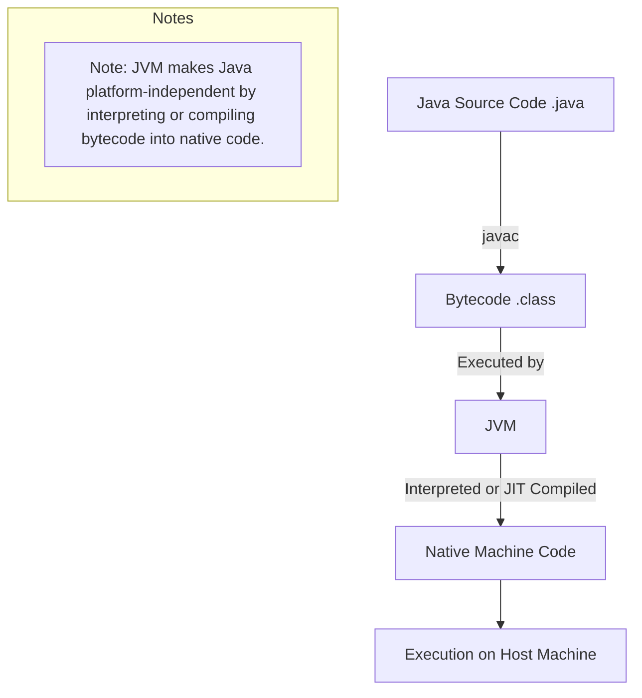
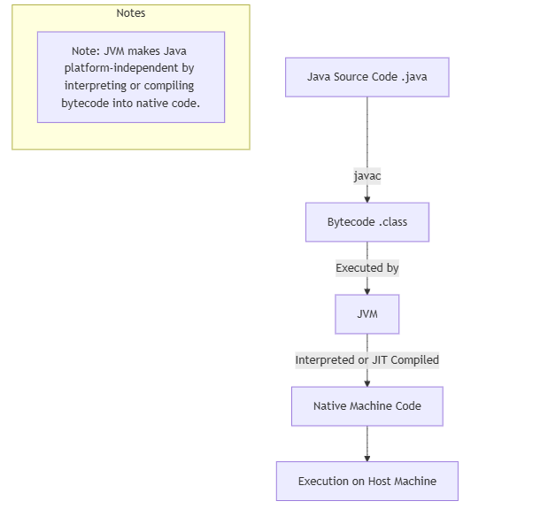
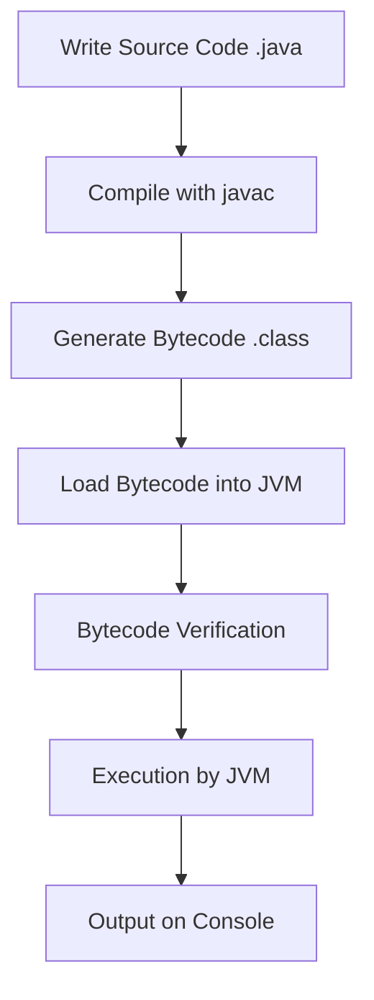

# DSA blog (Java and c++)
[Current progress](https://www.youtube.com/watch?v=6iCHf7OZn6c&list=PL6Zs6LgrJj3tDXv8a_elC6eT_4R5gfX4d)

## JAVA History
### **How Java Compiles Code**

Java is a platform-independent, high-level programming language that follows the **"write once, run anywhere" (WORA)** principle. This is achieved through the use of the **Java Virtual Machine (JVM)**. The compilation process in Java involves two main stages:

#### **1. Source Code to Bytecode Compilation**
- Java code is written in files with the `.java` extension.
- The **Java Compiler (`javac`)** compiles the `.java` files into **bytecode**, which is an intermediate, platform-independent code. The bytecode is stored in `.class` files.
- Bytecode is not directly executable by the operating system; it is designed to be run on the JVM.

#### **2. Bytecode Execution by the JVM**
- The JVM interprets the bytecode and executes it on the host machine. This happens in two ways:
  - **Interpretation:** The JVM reads, interprets, and executes bytecode instructions line by line.
  - **Just-In-Time (JIT) Compilation:** For performance optimization, the JVM uses a JIT compiler to convert frequently executed sections of bytecode into native machine code. This compiled native code is then executed directly by the CPU, resulting in faster performance.

This two-step process ensures that Java programs are platform-independent, as the bytecode can be executed on any JVM implementation, regardless of the underlying hardware or operating system.

---

### **History of Java**

#### **1. Origins**
- Java was initially developed by **James Gosling** and his team at Sun Microsystems in **1991** as part of a project called **"Green Project"**.
- It was originally named **Oak** after an oak tree outside Gosling's office. Later, the name was changed to **Java**, inspired by Java coffee.

#### **2. Goals**
The primary goals behind the development of Java were:
- **Platform independence:** The code should run on any device or operating system without modification.
- **Simplicity and ease of use:** Java was designed to be simpler than C and C++ while avoiding complex features like pointers and manual memory management.
- **Security:** Java introduced a secure execution environment for running untrusted code, such as applets in web browsers.
- **Networking:** Java was built with robust networking capabilities from the start.
- **Object-Oriented Programming (OOP):** Java fully embraced the OOP paradigm to promote modular, reusable, and maintainable code.

#### **3. Timeline**
- **1991:** Development began under the name Oak.
- **1995:** Java 1.0 was officially released by Sun Microsystems. It gained popularity for its ability to run applets in web browsers.
- **1997:** Sun Microsystems released Java Development Kit (JDK) 1.1, which added new features like JDBC and inner classes.
- **1999:** Java 2 (J2SE 1.2) introduced significant changes, including Swing for GUI development and the Collections Framework.
- **2006:** Sun Microsystems open-sourced Java under the GNU General Public License (GPL).
- **2010:** Oracle Corporation acquired Sun Microsystems, taking over Java's development and support.
- **2017:** Oracle introduced a new release cadence—Java would receive a major update every 6 months.
- **2021:** Java celebrated its 25th anniversary, with Java 17 becoming the next Long-Term Support (LTS) release.

---

### **Key Features of Java**
1. **Platform Independence:** Achieved through the JVM and bytecode.
2. **Object-Oriented:** Encourages modular and reusable code.
3. **Robust and Secure:** Features like exception handling, garbage collection, and the Java Security Manager enhance reliability and security.
4. **Multithreading:** Built-in support for concurrent programming.
5. **Portable:** Java code can run on any machine with a compatible JVM.
6. **High Performance:** Achieved through the JIT compiler.

---

### **Conclusion**
Java's unique compilation process and its design goals have made it one of the most popular and enduring programming languages. Its history reflects a continuous effort to adapt and evolve with changing technology trends, ensuring its relevance in modern software development.


Here’s how you can represent Java's **compilation process** and **roots** using a **Mermaid diagram** along with a Markdown table.

---

### **1. Mermaid Diagram: Java Compilation Process**



### **How to Use**
- Copy the above Mermaid code and paste it into a Markdown editor that supports Mermaid (e.g., VS Code with the Mermaid plugin, or an online tool like [Mermaid Live Editor](https://mermaid-js.github.io/mermaid-live-editor/)).
- This diagram illustrates the flow of Java's compilation process.

.
---

### **2. Table: Why Java Works the Way It Does**

| **Feature/Characteristic** | **Reason/Root**                                                                                     |
|-----------------------------|----------------------------------------------------------------------------------------------------|
| **Platform Independence**  | Java was designed to run on different devices (e.g., PCs, servers, embedded systems). The bytecode and JVM ensure the same code can run anywhere without modification. |
| **Bytecode**               | Bytecode serves as an intermediate representation, making Java portable and secure. It is also compact and efficient for transmission across networks. |
| **JVM (Java Virtual Machine)** | The JVM abstracts away hardware and OS details, providing a consistent runtime environment. This was essential for cross-platform compatibility. |
| **Garbage Collection**      | Java automates memory management to prevent memory leaks and improve reliability, addressing common issues in languages like C/C++. |
| **Security**                | Java was built with a focus on secure execution of untrusted code (e.g., applets in browsers). Features like the Security Manager and sandboxing protect systems from malicious code. |
| **Object-Oriented Design**  | OOP promotes code reusability, modularity, and simplicity, aligning with Java's goal of being easy to learn and use. |
| **Networking Support**      | Java was developed during the rise of the internet. Its built-in networking libraries made it ideal for distributed computing and web-based applications. |
| **JIT Compiler**            | To balance performance and portability, Java uses Just-In-Time (JIT) compilation to convert frequently used bytecode into native machine code at runtime. |
| **Simplicity**              | Java removed complex features like pointers, multiple inheritance (replaced by interfaces), and manual memory management to make it easier to learn and use. |
| **Open-Source**             | Since 2006, Java has been open-sourced to foster community-driven development and widespread adoption. |

---

### **Summary**
- The **Mermaid diagram** effectively visualizes Java's compilation process, from source code to execution.
- The **table** provides insights into why Java was developed with specific features, reflecting its design philosophy of platform independence, simplicity, and security.

## Java get started

Compiling and executing a Java program involves a series of steps that transform human-readable source code into machine-executable instructions. Below is a **detailed step-by-step explanation** of how Java compiles and runs code:

---

### **Step-by-Step Process of Java Compilation and Execution**

#### **1. Writing the Source Code**
- The programmer writes Java source code in a `.java` file using any text editor or Integrated Development Environment (IDE) such as IntelliJ IDEA, Eclipse, or VS Code.
- Example of a simple Java program:

```java
// File: HelloWorld.java
public class HelloWorld {
    public static void main(String[] args) {
        System.out.println("Hello, World!");
    }
}
```

---

#### **2. Saving the File**
- The file must be saved with the same name as the public class defined in the program, with a `.java` extension (e.g., `HelloWorld.java`).

---

#### **3. Compilation Using the Java Compiler (`javac`)**
- The source code is compiled into **bytecode** by the Java compiler (`javac`), which is part of the Java Development Kit (JDK).
- Bytecode is an intermediate representation of the program, which is platform-independent and stored in `.class` files.

##### **Command:**
```bash
javac HelloWorld.java
```

##### **What Happens During Compilation:**
1. **Syntax Checking:** The compiler checks for syntax errors in the source code. If there are errors (e.g., missing semicolons, unmatched braces), the compilation fails, and error messages are displayed.
2. **Generation of `.class` File:** If no errors are found, the compiler generates a `.class` file (e.g., `HelloWorld.class`) containing the bytecode for the program.

---

#### **4. Loading the Bytecode into the JVM**
- The `.class` file (bytecode) is not directly executable by the operating system. It must be executed within the **Java Virtual Machine (JVM)**.
- The JVM is an interpreter and runtime environment that translates bytecode into platform-specific machine code.

##### **Command:**
```bash
java HelloWorld
```

##### **What Happens During Execution:**
1. **Class Loader:**
   - The JVM uses a **Class Loader** to load the `.class` file into memory.
   - It loads all the required classes (including system classes like `java.lang.String`) and ensures they are available for execution.
2. **Bytecode Verification:**
   - The JVM runs a **Bytecode Verifier** to ensure the bytecode is valid and safe to execute. This step prevents malicious or corrupted bytecode from running.
   - The verifier checks for issues like illegal memory access or stack overflows.
3. **Execution by the JVM:**
   - The JVM interprets the bytecode line-by-line or uses the **Just-In-Time (JIT) Compiler** to convert frequently used bytecode into native machine code for faster execution.

---

#### **5. Output**
- The program’s output is displayed on the console. In this case, the output would be:

```
Hello, World!
```

---

### **Detailed Components Involved in Compilation and Execution**

#### **A. Java Development Kit (JDK)**
- The JDK is a software development environment that provides tools to develop Java programs. It includes:
  - `javac` (Java Compiler)
  - `java` (Java Virtual Machine)
  - Other tools like `javadoc`, `jar`, etc.

#### **B. Java Virtual Machine (JVM)**
The JVM is responsible for executing the bytecode. Its key components are:
1. **Class Loader:** Loads `.class` files into memory.
2. **Bytecode Verifier:** Ensures the bytecode is valid and secure.
3. **Execution Engine:** Executes the bytecode.
   - **Interpreter:** Executes the bytecode line-by-line.
   - **Just-In-Time (JIT) Compiler:** Compiles frequently executed code into native machine code for better performance.

#### **C. Java Runtime Environment (JRE)**
- The JRE is a subset of the JDK. It provides the JVM and necessary libraries to run Java programs but does not include development tools like the compiler.

---

### **Why Java Uses This Process**

1. **Platform Independence:**
   - Java programs are compiled into bytecode, which can run on any machine with a compatible JVM, making Java platform-independent.
   - This aligns with Java's "Write Once, Run Anywhere" (WORA) philosophy.

2. **Security:**
   - The Bytecode Verifier ensures that only safe and valid code is executed, protecting the system from potentially harmful code.

3. **Performance Optimization:**
   - The JIT Compiler improves performance by translating bytecode into native machine code during runtime.

4. **Modularity:**
   - The Class Loader dynamically loads required classes, making the program modular and memory-efficient.

---

### **Summary of Commands**

| **Step**         | **Command**                  | **Description**                                                                 |
|-------------------|------------------------------|---------------------------------------------------------------------------------|
| **Write Code**    | -                            | Write the source code in a `.java` file.                                       |
| **Compile Code**  | `javac HelloWorld.java`      | Compiles the `.java` file into a `.class` file (bytecode).                     |
| **Run Program**   | `java HelloWorld`            | Executes the bytecode using the JVM and displays the program’s output.         |

---

### **Diagram: Java Compilation Process (Mermaid)**



---

### **Conclusion**
The Java compilation process is designed to ensure portability, security, and performance. By converting source code into bytecode and executing it on the JVM, Java achieves platform independence and maintains a robust runtime environment for executing applications.